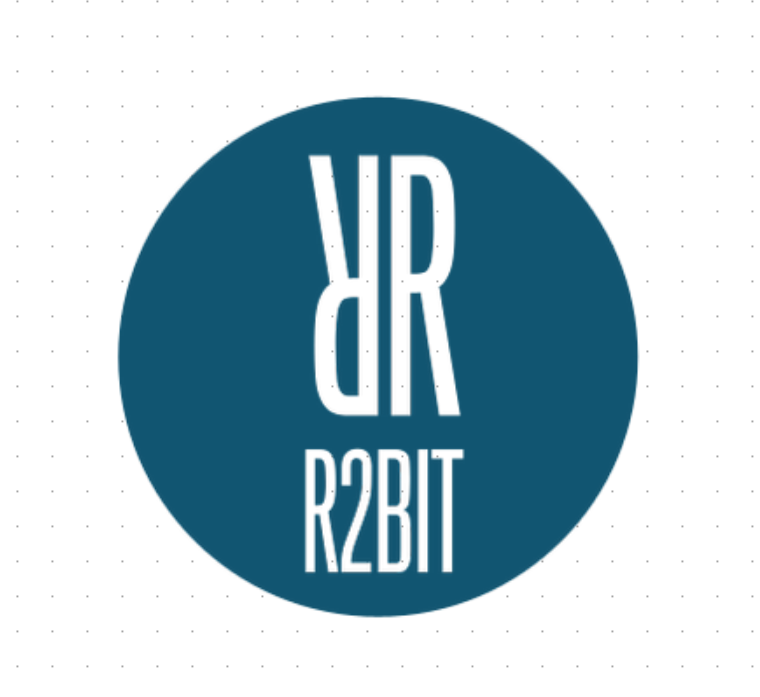

---
output:
  github_document
---

<!-- README.md is generated from README.Rmd. Please edit that file -->

```{r, echo = FALSE}
knitr::opts_chunk$set(
  collapse = TRUE,
  comment = "#>",
  fig.path = "figures/README-"
)
```

# bitTA 

## Overview

`bitTA`은 자연어 처리(Natural Language Processing), 텍스트 분석 모델 및 텍스트 분석을 위한 시각화와 도구 모음.

## Usage bitTA

### 설치하기

```{r, eval= FALSE}
remotes::install_github("bit2r/bitTA")
```


### 한글 자동 띄어쓰기

한글 문장을 띄어쓰기 규칙에 맞게 자동으로 띄어쓰기 보정

```{r eval = TRUE, warning=FALSE}
library(bitTA)

get_spacing("최근음성인식정확도가높아짐에따라많은음성데이터가Text로변환되고분석되기시작했는데,이를위해잘동작하는띄어쓰기엔진은거의필수적인게되어버렸다")
str <- "글쓰기에서맞춤법과띄어쓰기를올바르게하는것은좋은글이될수있는요건중하나이다.하지만요즘학생들은부족한어문규정지식으로인해맞춤법과띄어쓰기에서많은오류를범하기도한다.본연구는그중띄어쓰기가글을인식하는데중요한역할을하는것으로판단하여,대학생들이띄어쓰기에대해서어느정도정확하게인식하고있는지,실제오류실태는어떠한지에대해살펴서그오류를개선할수있는교육방안을마련할필요가있다고판단하였다."
get_spacing(str)
```

### 형태소 분석

#### Mecab 형태소 분석기

Mecab 형태소 분석기를 호출하여 형태소 분석을 수행

```{r eval = TRUE}
morpho_mecab("아버지가 방에 들어가신다.")

morpho_mecab("아버지가 방에 들어가신다.", type = "verb")
```


