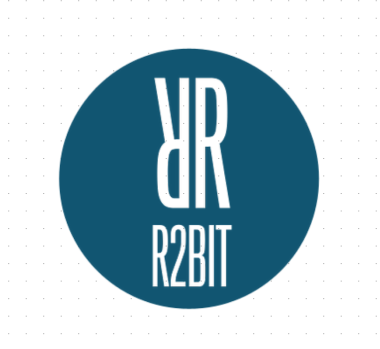
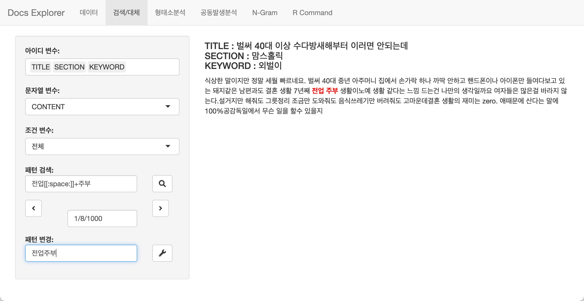

<!-- README.md is generated from README.Rmd. Please edit that file -->

# bitTA <a href='https://r2bit.com/bitTA/' target='_blank'></a>

## bitTA 개요

`bitTA`는 `텍스트 데이터를 탐색(Explore Documents)`하고,
`자연어 처리(Natural Language Processing)` 및 `형태소분석`, `감성분석`을
수행하는, **한글 텍스트 데이터 분석 도구들의 모음**입니다.

`bitTA`의 다음 기능은 bitTA 패키지의 비네트인
<a href="https://r2bit.com/bitTA/articles/Introduce.html"
target="_blank">Introduce bitTA</a>에 소개되어 있습니다.

-   텍스트 데이터 전처리 기능
-   텍스트 데이터 탐색 기능
-   형태소분석 기능
-   감성분석 기능

## bitTA 설치

### bitTA 패키지 설치하기

Github 리파지토리에서 배포하는 패키지를 다음과 같이 설치합니다.

``` r
remotes::install_github("bit2r/bitTA")
```

### 관련 리소스 설치하기

bitTA를 사용하기 위해서는 다음의 두 리소스를 설치해야 합니다.

-   은전한닢 형태소분석기 시스템과 사전
    -   mecab-ko 혹은 mecab-ko-msvc
    -   mecab-ko-dic
-   RcppMeCab 패키지
    -   R에서 mecab-ko 연동을 위한 R 패키지

은전한닢 형태소분석기 시스템과 사전은 bitTA 패키지의 비네트인
<a href="https://r2bit.com/bitTA/articles/Install_mecab.html"
target="_blank">Install mecab-ko</a>에 설명되어 있습니다.

사전에 설치해야 하는 리소스는 다음의 순서와 방법대로 설치하는 것을
추천합니다.

1.  은전한닢 형태소분석기 시스템과 사전

``` r
library("bitTA")

install_mecab_ko()
```

2.  RcppMeCab 패키지 설치

``` r
install.packages("RcppMeCab")
```

## bitTA 사용하기

### 한글 자동 띄어쓰기

한글 문장을 띄어쓰기 규칙에 맞게 자동으로 띄어쓰기 보정

``` r
library(bitTA)

get_spacing("최근음성인식정확도가높아짐에따라많은음성데이터가텍스트로변환되고분석되기시작했는데,이를위해잘동작하는띄어쓰기엔진은거의필수적인게되어버렸다")
#> [1] "최근 음성 인식 정확도가 높아 짐에 따라 많은 음성 데이터가 텍스트로 변환되고 분석되기 시작했는데, 이를 위해 잘 동작하는 띄어쓰기 엔진은 거의 필수적인 게 되어 버렸다"
str <- "글쓰기에서맞춤법과띄어쓰기를올바르게하는것은좋은글이될수있는요건중하나이다.하지만요즘학생들은부족한어문규정지식으로인해맞춤법과띄어쓰기에서많은오류를범하기도한다.본연구는그중띄어쓰기가글을인식하는데중요한역할을하는것으로판단하여,대학생들이띄어쓰기에대해서어느정도정확하게인식하고있는지,실제오류실태는어떠한지에대해살펴서그오류를개선할수있는교육방안을마련할필요가있다고판단하였다."
get_spacing(str)
#> [1] "글쓰기에서 맞춤법과 띄어쓰기를 올바르게 하는 것은 좋은 글이 될 수 있는 요건 중 하나이다. 하지만 요즘 학생들은 부족한 어문 규정 지식으로 인해 맞춤법과 띄어쓰기에서 많은 오류를 범하기도 한다. 본 연구는 그중 띄어쓰기가 글을 인식하는 데 중요한 역할을 하는 것으로 판단하여, 대학생들이 띄어쓰기에 대해서 어느 정도 정확하게 인식하고 있는지, 실제 오류 실태는 어떠한지에 대해 살펴서 그 오류를 개선할 수 있는 교육 방안을 마련할 필요가 있다고 판단하였다."
```

### 형태소 분석

은전한닢 형태소 분석기를 호출하여 형태소 분석을 수행합니다. bitTA는 이
형태소분석을 쉽고 효과적으로 수행하는 것을 도와줍니다.

형태소분석은 비네트인
<a href="https://r2bit.com/bitTA/articles/morphology.html"
target="_blank">Morphological Analysis</a>에 설명되어 있습니다.

``` r
docs <- c("님은 갔습니다. 아아, 사랑하는 나의 님은 갔습니다.",
          "푸른 산빛을 깨치고 단풍나무 숲을 향하여 난 작은 길을 걸어서, 차마 떨치고 갔습니다.")
morpho_mecab(docs,  type = "morpheme")
#> [[1]]
#>      NNG       JX    VV+EP       EF       SF       IC       SC      NNG 
#>     "님"     "은"     "갔" "습니다"      "."   "아아"      ","   "사랑" 
#>      XSV      ETM       NP      JKG      NNG       JX    VV+EP       EF 
#>     "하"     "는"     "나"     "의"     "님"     "은"     "갔" "습니다" 
#>       SF 
#>      "." 
#> 
#> [[2]]
#>     VA+ETM        NNG        NNG        JKO         VV         EC        NNG 
#>     "푸른"       "산"       "빛"       "을"     "깨치"       "고" "단풍나무" 
#>        NNG        JKO         VV         EC      NP+JX         VA        ETM 
#>       "숲"       "을"     "향하"       "여"       "난"       "작"       "은" 
#>        NNG        JKO      VV+EC         SC        MAG         VV         EC 
#>       "길"       "을"   "걸어서"        ","     "차마"     "떨치"       "고" 
#>      VV+EP         EF         SF 
#>       "갔"   "습니다"        "."
```

한글 텍스트에서는 명사만으로 문맥을 파악하는 것이 유용합니다.
morpho_mecab() 함수의 기본 인수는 이를 지원합니다.

``` r
morpho_mecab(docs)
#> [[1]]
#>    NNG    NNG    NNG 
#>   "님" "사랑"   "님" 
#> 
#> [[2]]
#>        NNG        NNG        NNG        NNG        NNG 
#>       "산"       "빛" "단풍나무"       "숲"       "길"
```

morpho_mecab()는 여러 개의 문서를 하나로 합쳐서 토크나이즈할 수도
있습니다.

``` r
morpho_mecab(docs, indiv = FALSE)
#>        NNG        NNG        NNG        NNG        NNG        NNG        NNG 
#>       "님"     "사랑"       "님"       "산"       "빛" "단풍나무"       "숲" 
#>        NNG 
#>       "길"
```

#### 품사의 워드클라우드 그리기

명사를 추출하여 워드클라우드를 그려봅니다. bitTA에 수록된 대통령 연설문
데이터셋인 `president_speech`에서 임의의 연설문 100개에서 일반명사를
추출 후 워드클라우드를 그려 봅니다.

``` r
president_speech$contents[1:100] %>% 
  morpho_mecab(indiv = FALSE) %>% 
  table() %>% 
  wordcloud2::wordcloud2(fontFamily = "NanumSquare")
```


### 텍스트 데이터 탐색

텍스트 데이터 탐색 기능은 비네트인
<a href="https://r2bit.com/bitTA/articles/explore_docs.html"
target="_blank">Explore Documents</a>에 설명되어 있습니다.

#### Text Data Explorer

텍스트 데이터 탐색 기능은 **Text Data Explorer**라는 이름의 Shiny 앱이
제공합니다. 그리고 그 기능은 다음과 같습니다.

-   데이터 구조 파악하기
-   데이터 탐색과 정제하기
-   패턴검색과 문자열 대체
-   형태소분석을 이용한 데이터 탐색
-   공동발생분석을 이용한 데이터 탐색
-   n-grams를 이용한 데이터 탐색
-   R 명령어 실행

#### Text Data Explorer 예시 화면

-   Text Data Explorer 기능 중에서 탐색 및 치환 기능 화면에 대한 예시는
    다음과 같습니다.:



### tidytext와의 협업

`tidytext` 패키지와의 협업을 위한 기능은 비네트인
<a href="https://r2bit.com/bitTA/articles/with_tidytext.html"
target="_blank">Collaboration with tidytext package</a>에 설명되어
있습니다.

#### tokenizers

bitTA는 토크나이저로 다음과 같은 함수를 지원합니다.

-   형태소 토크나이저
    -   morpho_mecab()
    -   part-of-speech tagger 단위의 토크나이저
-   명사 n-grams 토크나이저
    -   **tokenize_noun_ngrams()**

``` r
docs <- c("님은 갔습니다. 아아, 사랑하는 나의 님은 갔습니다.",
          "푸른 산빛을 깨치고 단풍나무 숲을 향하여 난 작은 길을 걸어서, 차마 떨치고 갔습니다.")

tokenize_noun_ngrams(docs)
#> [[1]]
#> [1] "님 사랑 님"
#> 
#> [[2]]
#> [1] "산 빛 단풍나무" "빛 단풍나무 숲" "단풍나무 숲 길"

# simplify = TRUE
tokenize_noun_ngrams(docs[1], simplify = TRUE)
#> [1] "님 사랑 님"

str <- "신혼부부나 주말부부는 놀이공원 자유이용권을 즐겨 구매합니다."

tokenize_noun_ngrams(str)
#> [[1]]
#> [1] "신혼 부부 주말"     "부부 주말 부부"     "주말 부부 놀이공원"
#> [4] "부부 놀이공원 자유" "놀이공원 자유 이용" "자유 이용 구매"

# 불용어 처리
tokenize_noun_ngrams(str, stopwords = "구매")
#> [[1]]
#> [1] "신혼 부부 주말"     "부부 주말 부부"     "주말 부부 놀이공원"
#> [4] "부부 놀이공원 자유" "놀이공원 자유 이용"
 
# 사용자 정의 사전 사용
dic_path <- system.file("dic", package = "bitTA")
dic_file <- glue::glue("{dic_path}/buzz_dic.dic")
tokenize_noun_ngrams(str, simplify = TRUE, user_dic = dic_file)
#> [1] "신혼부부 주말부부 놀이공원"   "주말부부 놀이공원 자유이용권"
#> [3] "놀이공원 자유이용권 구매"

# n_min
tokenize_noun_ngrams(str, n_min = 1, user_dic = dic_file)
#> [[1]]
#>  [1] "신혼부부"                     "신혼부부 주말부부"           
#>  [3] "신혼부부 주말부부 놀이공원"   "주말부부"                    
#>  [5] "주말부부 놀이공원"            "주말부부 놀이공원 자유이용권"
#>  [7] "놀이공원"                     "놀이공원 자유이용권"         
#>  [9] "놀이공원 자유이용권 구매"     "자유이용권"                  
#> [11] "자유이용권 구매"              "구매"

# ngram_delim
tokenize_noun_ngrams(str, ngram_delim = ":", user_dic = dic_file)
#> [[1]]
#> [1] "신혼부부:주말부부:놀이공원"   "주말부부:놀이공원:자유이용권"
#> [3] "놀이공원:자유이용권:구매"

# bi-grams
tokenize_noun_ngrams(str, n = 2, ngram_delim = ":", user_dic = dic_file)
#> [[1]]
#> [1] "신혼부부:주말부부"   "주말부부:놀이공원"   "놀이공원:자유이용권"
#> [4] "자유이용권:구매"
```

#### 한글 unnest_tokens

bitTA의 한글 `unnest_tokens`에는 명사 n-grams 토크나이즈를 지원하는
`unnest_noun_ngrams()` 함수가 있습니다. 이 함수는 `tidytext` 패키지의
`unnest_tokens` 함수군의 사용법과 거의 동일합니다.

``` r
library(dplyr)

president_speech %>%
  select(title, doc) %>% 
  filter(row_number() <= 2) %>%
  unnest_noun_ngrams(
    noun_bigram,
    doc,
    n = 2,
    ngram_delim = ":",
    type = "noun2"
  )
#> # A tibble: 271 × 2
#>    title                              noun_bigram
#>    <chr>                              <chr>      
#>  1 "2005 한일 우정의 해 개막식 축사 " 일:우정    
#>  2 "2005 한일 우정의 해 개막식 축사 " 우정:해    
#>  3 "2005 한일 우정의 해 개막식 축사 " 해:개막식  
#>  4 "2005 한일 우정의 해 개막식 축사 " 개막식:축하
#>  5 "2005 한일 우정의 해 개막식 축사 " 축하:행사  
#>  6 "2005 한일 우정의 해 개막식 축사 " 행사:축하  
#>  7 "2005 한일 우정의 해 개막식 축사 " 축하:참석  
#>  8 "2005 한일 우정의 해 개막식 축사 " 참석:여러분
#>  9 "2005 한일 우정의 해 개막식 축사 " 여러분:모두
#> 10 "2005 한일 우정의 해 개막식 축사 " 모두:환영  
#> # … with 261 more rows
```

## 고마운 분들

-   김준혁
    -   <a href="https://github.com/junhewk/RcppMeCab"
        target="_blank">RcppMeCab</a>
-   윤원섭
    -   <a href="https://github.com/Pusnow/mecab-ko-msvc"
        target="_blank">mecab-ko-msvc</a>

## 도움요청

bitTA의 발전을 위해서 버그에 대한 리포팅, 기능 개선을 위한 요구사항들은
<a href="https://github.com/bit2r/bitTA/issues"
target="_blank">여기에</a>에 문제를 제기하거나 요청해주세요. 특히 버그는
최소한의 재현 가능한 예제와 함께 제출바랍니다.

## 기여자 행동 강령

이 프로젝트는
<a href="https://github.com/bit2r/bitTA/blob/main/CONDUCT.md"
target="_blank">Contributor Code of Conduct(기여자 행동 강령)</a>과 함께
릴리스되었습니다 . 이 프로젝트에 참여함으로써 귀하는 해당 조건을
준수하는 데 동의하는 것입니다.
